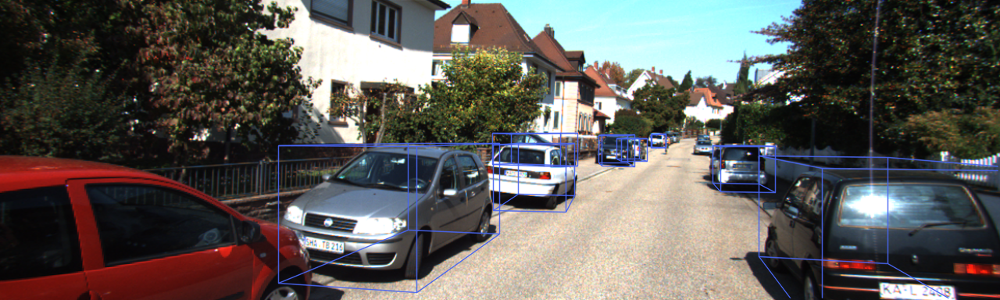

# TensorRT-SMOKE
This repo deploys [SMOKE](https://github.com/open-mmlab/mmdetection3d/tree/master/configs/smoke) using TensorRT for C++ inference.

## Prerequisites
- Install [TensorRT 8.0](https://developer.nvidia.cn/nvidia-tensorrt-8x-download)
  ```bash
  # https://developer.nvidia.cn/nvidia-tensorrt-8x-download
  tar -xvzf TensorRT-8.0.3.4.Linux.x86_64-gnu.cuda-10.2.cudnn8.2.tar.gz
  # export TENSORRT_DIR=~/TensorRT-8.0.3.4
  git clone -b release/8.0 https://github.com/Yibin122/TensorRT.git  # MMCVModulatedDeformConv2d plugin
  cd TensorRT
  git submodule update --init --recursive
  mkdir -p build && cd build
  cmake .. -DTRT_LIB_DIR=~/TensorRT-8.0.3.4/lib -DTRT_OUT_DIR=`pwd`/out -DCUDA_VERSION=10.2  # e.g. CUDA 10.2
  make -j$(nproc)
  make install
  ```
- [MMDetection3D](https://github.com/open-mmlab/mmdetection3d/blob/master/docs/zh_cn/getting_started.md) (v1.0.0)
  ```bash
  pip install torch==1.8.0 torchvision==0.9.0
  pip install mmcv-full==1.4.0
  pip install mmdet==2.19.0
  pip install mmsegmentation==0.20.0
  git clone -b v1.0.0rc0 https://gitee.com/open-mmlab/mmdetection3d.git
  cd mmdetection3d
  pip install -v -e .  # or "python setup.py develop"
  ```

## Steps
1. Export ONNX (first comment [code](https://github.com/open-mmlab/mmdetection3d/blob/master/mmdet3d/models/dense_heads/smoke_mono3d_head.py#L107-L112) in `mmdet3d/models/dense_heads/smoke_mono3d_head.py`)
   ```bash
   cd mmdetection3d
   python smoke_pth2onnx.py  # smoke_dla34.onnx
   ```
2. Build engine
   ```bash
   cd TensorRT-8.0.3.4/bin
   # use your own model_path
   ./trtexec --workspace=4096 --onnx=${model_path}/smoke_dla34.onnx --saveEngine=${model_path}/smoke_dla34.trt8
   ```
3. C++ inference
   ```bash
   cd TensorRT-SMOKE/
   mkdir build && cd build
   cmake ..
   make && ./smoke_trt
   ```
   

## TODO
- [ ] MonoFlex
